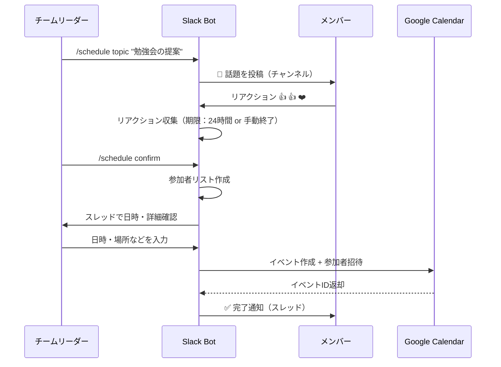
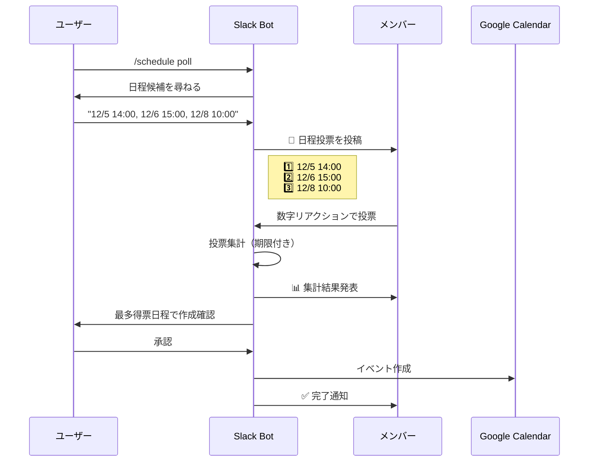

# Slack Bot × Googleカレンダー連携システム 仕様書

## 1. システム概要

本システムは、Slackワークスペース内でbotを通じて会話を促進し、その反応を基に複数人のスケジュールをGoogleカレンダーに自動作成するシステムです。

### 1.1 目的
- Slack上でのコミュニケーションを活性化
- スケジュール調整の簡素化
- 参加者の意思確認を明確化

### 1.2 主要な特徴
- 会話型インターフェースによる自然なスケジュール作成
- リアクションベースの参加者管理
- Googleカレンダーとのシームレスな連携

---

## 2. 機能要件

### 2.1 会話開始機能

#### 2.1.1 話題提起型
botが特定の話題について質問を投げかけ、メンバーの反応を促します。

**例:**
```
Bot: 📢 来週のチーム勉強会、興味がある方はいますか？
テーマ候補：
1️⃣ Dockerの基礎
2️⃣ GraphQL入門
3️⃣ CI/CD実践

興味のある番号にリアクションしてください！
```

#### 2.1.2 個別質問型
botが特定のメンバーに質問し、他のメンバーも会話に参加できるようにします。

**例:**
```
Bot: @山田さん、先日の提案について詳しく聞かせてもらえますか？🤔
他の方も興味があれば 👀 のリアクションをください！
```

### 2.2 リアクション収集機能

#### 2.2.1 リアクション検知
- botの投稿に対するリアクション（絵文字）を自動検知
- リアクションしたユーザーのリストを記録
- リアクション種別による参加意思の区別

#### 2.2.2 サポートするリアクション種別
| リアクション | 意味 | 処理 |
|------------|------|------|
| 👍 `:+1:` | 参加希望 | カレンダー招待対象 |
| ❤️ `:heart:` | 参加希望 | カレンダー招待対象 |
| 🎉 `:tada:` | 参加希望 | カレンダー招待対象 |
| ❓ `:question:` | 興味あり（仮） | スレッドで詳細確認 |
| 👀 `:eyes:` | 見守り | カレンダー招待対象外 |

### 2.3 スケジュール作成機能

#### 2.3.1 スケジュール情報入力
botがスレッド内で以下の情報を対話形式で収集します：

1. **イベント名** - 会議/イベントのタイトル
2. **日時** - 開催日時（候補日程の提示も可）
3. **所要時間** - イベントの長さ
4. **場所/URL** - オフライン場所またはオンライン会議URL
5. **説明** - イベントの詳細情報

**会話例:**
```
User: /schedule create

Bot: スケジュールを作成します！以下の情報を教えてください📅

Bot: イベント名は何ですか？

User: Docker勉強会

Bot: 日程の候補を教えてください（複数可）
例: 2025/12/01 14:00, 2025/12/03 15:00

User: 2025/12/05 14:00

Bot: 所要時間は？（例: 1時間、90分）

User: 2時間

Bot: 開催場所またはURLは？

User: https://meet.google.com/xxx-yyyy-zzz

Bot: 説明・アジェンダがあれば教えてください（省略可）

User: Dockerの基礎から実践まで
```

#### 2.3.2 参加者確定
- リアクションしたユーザーのSlackメールアドレスを取得
- Googleカレンダーの招待リストに追加

#### 2.3.3 Googleカレンダー連携
以下の情報でGoogleカレンダーにイベントを作成：

```json
{
  "summary": "イベント名",
  "location": "場所またはURL",
  "description": "説明 + 元のSlackメッセージURL",
  "start": {
    "dateTime": "2025-12-05T14:00:00+09:00",
    "timeZone": "Asia/Tokyo"
  },
  "end": {
    "dateTime": "2025-12-05T16:00:00+09:00",
    "timeZone": "Asia/Tokyo"
  },
  "attendees": [
    {"email": "user1@example.com"},
    {"email": "user2@example.com"}
  ],
  "reminders": {
    "useDefault": false,
    "overrides": [
      {"method": "email", "minutes": 1440},
      {"method": "popup", "minutes": 30}
    ]
  }
}
```

#### 2.3.4 完了通知
カレンダー作成後、Slackのスレッドに結果を通知：

```
Bot: ✅ Googleカレンダーにイベントを作成しました！

📅 Docker勉強会
🕒 2025/12/05 14:00 - 16:00
📍 https://meet.google.com/xxx-yyyy-zzz
👥 参加者: @山田さん @佐藤さん @鈴木さん（3名）

カレンダーの招待メールをご確認ください！
🔗 [カレンダーで確認](https://calendar.google.com/event?eid=xxx)
```

---

## 3. ユーザーストーリー

### ストーリー1: 話題提起からスケジュール作成
```
As a チームリーダー
I want to botで話題を投げかけて興味のある人を集めたい
So that 関心のあるメンバーだけでミーティングを設定できる
```

**受け入れ条件:**
- botが話題を投稿できる
- メンバーがリアクションで意思表示できる
- リアクションした人だけがカレンダーに招待される

### ストーリー2: 日程候補から参加者投票
```
As a イベント企画者
I want to 複数の日程候補を提示して投票を募りたい
So that 最も参加者の多い日程で開催できる
```

**受け入れ条件:**
- 複数の日程候補を提示できる
- 各候補にリアクションで投票できる
- 最多得票の日程でカレンダーが作成される

### ストーリー3: 質問からディスカッション誘導
```
As a チームメンバー
I want to botの質問に答えながら他のメンバーとも会話したい
So that 自然な流れでミーティングが設定される
```

**受け入れ条件:**
- botが個別に質問できる
- スレッドで会話が展開できる
- 会話の参加者でスケジュールが作成される

---

## 4. 技術要件

### 4.1 Slack連携

#### 4.1.1 必要なSlack App権限（Scopes）
**Bot Token Scopes:**
- `chat:write` - メッセージ投稿
- `chat:write.public` - パブリックチャンネルへの投稿
- `channels:read` - チャンネル情報の取得
- `channels:history` - メッセージ履歴の取得
- `reactions:read` - リアクション情報の取得
- `users:read` - ユーザー情報の取得
- `users:read.email` - ユーザーのメールアドレス取得
- `commands` - スラッシュコマンドの使用

**Event Subscriptions:**
- `reaction_added` - リアクション追加の検知
- `message.channels` - チャンネルメッセージの受信
- `app_mention` - メンション検知

#### 4.1.2 Slack APIエンドポイント
- `chat.postMessage` - メッセージ投稿
- `reactions.get` - リアクション取得
- `users.info` - ユーザー情報取得
- `users.lookupByEmail` - メールアドレスからユーザー検索

### 4.2 Google Calendar連携

#### 4.2.1 必要なGoogle API権限
- `https://www.googleapis.com/auth/calendar` - カレンダーへの読み書き
- `https://www.googleapis.com/auth/calendar.events` - イベント管理

#### 4.2.2 Google Calendar API
- `events.insert` - イベント作成
- `events.update` - イベント更新
- `events.delete` - イベント削除

### 4.3 データストア

#### 4.3.1 保存が必要なデータ
```javascript
// イベントトラッキング
{
  "slack_message_ts": "1234567890.123456",
  "channel_id": "C01234567",
  "event_title": "Docker勉強会",
  "status": "collecting_reactions|scheduling|completed",
  "reactions": [
    {
      "user_id": "U01234567",
      "user_email": "user@example.com",
      "reaction": "👍",
      "timestamp": "2025-11-21T10:00:00Z"
    }
  ],
  "calendar_event_id": "abc123xyz",
  "created_at": "2025-11-21T09:00:00Z",
  "updated_at": "2025-11-21T10:30:00Z"
}
```

### 4.4 システムアーキテクチャ

```
┌─────────────┐
│   Slack     │
│  Workspace  │
└──────┬──────┘
       │ Events/Commands
       ↓
┌─────────────────────┐
│   Slack Bot Server  │
│                     │
│  ┌───────────────┐  │
│  │ Event Handler │  │
│  └───────────────┘  │
│  ┌───────────────┐  │
│  │  Scheduler    │  │
│  └───────────────┘  │
│  ┌───────────────┐  │
│  │  DB Manager   │  │
│  └───────────────┘  │
└──────┬──────────────┘
       │
       ├─────────────────┐
       ↓                 ↓
┌─────────────┐   ┌──────────────┐
│  Database   │   │   Google     │
│  (MongoDB/  │   │   Calendar   │
│  PostgreSQL)│   │     API      │
└─────────────┘   └──────────────┘
```

---

## 5. ユーザーフロー

### フロー1: 話題提起型スケジュール作成



### フロー2: 日程調整型



---

## 6. コマンド仕様

### 6.1 スラッシュコマンド

#### `/schedule topic [話題]`
話題提起型の投稿を作成

**使用例:**
```
/schedule topic 来週のチーム会議について
```

#### `/schedule poll`
日程調整投票を開始

**使用例:**
```
/schedule poll
```

#### `/schedule create`
対話形式でスケジュール作成

**使用例:**
```
/schedule create
```

#### `/schedule confirm [message_link]`
特定のメッセージからスケジュール確定

**使用例:**
```
/schedule confirm https://xxx.slack.com/archives/C123/p1234567890
```

### 6.2 メンション対応

#### `@bot [質問]`
botに質問して会話を開始

**使用例:**
```
@bot 次の勉強会のテーマ案を出してもらえますか？
```

---

## 7. 非機能要件

### 7.1 パフォーマンス
- リアクション検知: 5秒以内
- カレンダー作成: 10秒以内
- 同時処理: 最大50イベント

### 7.2 セキュリティ
- OAuth 2.0によるGoogle認証
- Slack App認証トークンの安全な保管
- ユーザーメールアドレスの暗号化保存

### 7.3 可用性
- 稼働率: 99.5%以上
- エラー発生時の自動リトライ機能
- システムダウン時の通知

### 7.4 拡張性
- 他のカレンダーサービス（Outlook、Apple Calendar）への対応準備
- 多言語対応の基盤
- カスタマイズ可能なリアクション設定

---

## 8. 制約事項

### 8.1 技術的制約
- Slack APIのレート制限: 1メッセージ/秒
- Google Calendar APIのレート制限: 1000リクエスト/100秒
- 1イベントあたりの最大参加者数: 200名

### 8.2 ビジネス制約
- Slack有料プランが必要（メールアドレス取得のため）
- Google Workspace管理者による事前承認が必要
- 外部ユーザーの招待には制限がある場合がある

---

## 9. 今後の拡張案

### 9.1 フェーズ2
- リマインダー機能（イベント前日・当日通知）
- 定期イベントの作成
- イベントのキャンセル/変更機能

### 9.2 フェーズ3
- AI による最適日程提案
- 参加者の空き時間自動チェック
- 議事録自動作成・共有

### 9.3 フェーズ4
- Zoom/Teams連携
- タイムゾーン自動調整
- 多言語対応（英語、中国語など）

---

## 10. 付録

### 10.1 用語集

| 用語 | 説明 |
|------|------|
| Slack Bot | Slack APIを使用して動作する自動化プログラム |
| リアクション | Slackメッセージに対する絵文字による反応 |
| スレッド | Slackメッセージへの返信で形成される会話スレッド |
| OAuth 2.0 | 安全な認証・認可のための標準プロトコル |
| イベント | Googleカレンダーにおける予定・スケジュール |

### 10.2 参考リンク

- [Slack API Documentation](https://api.slack.com/)
- [Google Calendar API Documentation](https://developers.google.com/calendar)
- [Slack Events API](https://api.slack.com/events-api)
- [OAuth 2.0 Specification](https://oauth.net/2/)

---

**文書バージョン:** 1.0  
**作成日:** 2025年11月21日  
**最終更新日:** 2025年11月21日  
**作成者:** システム開発チーム
