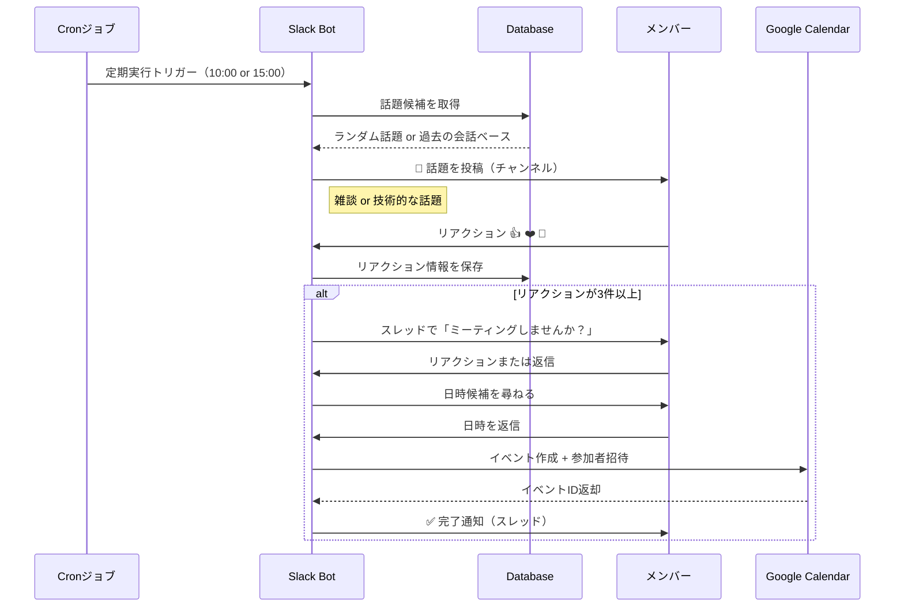
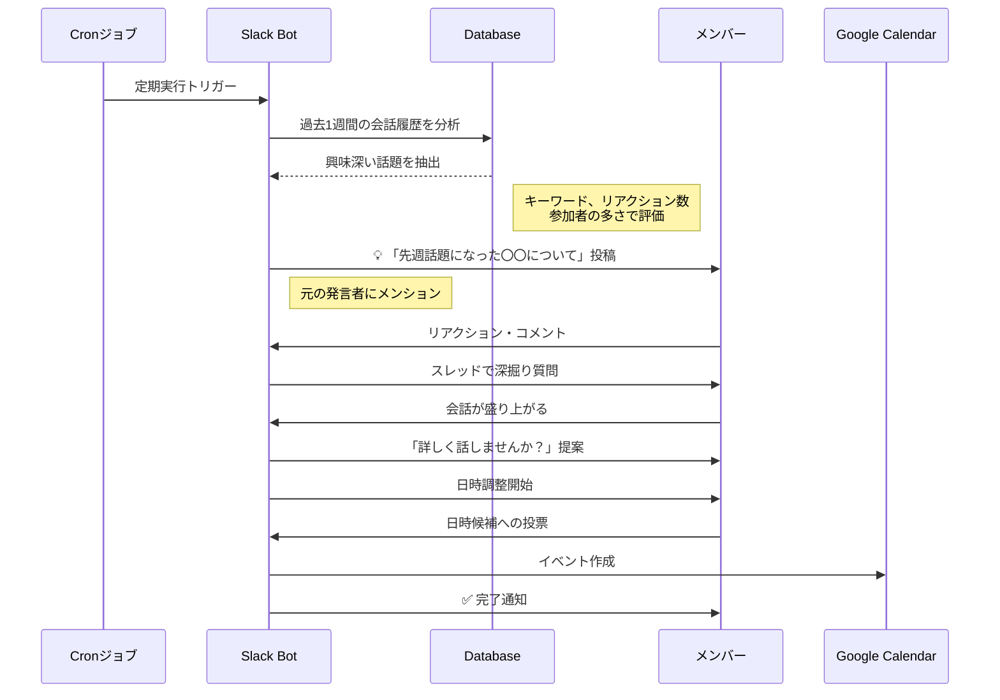
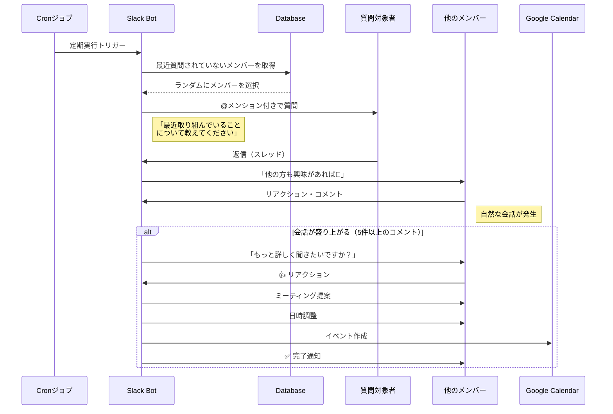

# Slack Bot × Googleカレンダー連携システム 仕様書

## 1. システム概要

本システムは、Slackワークスペース内でbotを通じて会話を促進し、その反応を基に複数人のスケジュールをGoogleカレンダーに自動作成するシステムです。

### 1.1 目的
- Slack上でのコミュニケーションを活性化
- スケジュール調整の簡素化
- 参加者の意思確認を明確化

### 1.2 主要な特徴
- 会話型インターフェースによる自然なスケジュール作成
- リアクションベースの参加者管理
- Googleカレンダーとのシームレスな連携

---

## 2. 機能要件

### 2.1 定期的な話題提供機能

#### 2.1.1 自動実行スケジュール
botは以下のスケジュールで自動的に話題を提供します：

**実行タイミング:**
- **平日**: 10:00, 15:00（1日2回）
- **週末**: 実行なし（オプションで設定可能）
- **カスタマイズ可能**: ワークスペースごとに時間帯を設定可

**実行条件:**
- 前回の話題投稿から最低4時間経過
- 直近1時間にチャンネルでの会話がない場合を優先
- 特定のチャンネル（例: #random, #general）を対象

#### 2.1.2 話題生成ロジック

##### A. ランダム話題生成
事前に定義された話題テンプレートからランダムに選択します。

**雑談的な話題例:**
```
Bot: ☕ 今日のランチは何を食べましたか？おすすめがあればシェアしてください！
興味がある方は 👍 でリアクション！

Bot: 🎮 最近ハマっているゲームや趣味はありますか？
語りたい方は 🎉 でリアクション！

Bot: 📚 最近読んだ本や漫画で面白かったものを教えてください！
おすすめしたい方は 📖 でリアクション！

Bot: 🎵 作業中に聞く音楽のジャンルは？集中できるBGMを共有しましょう！
参加したい方は 🎧 でリアクション！

Bot: ☕ お気に入りのカフェやコーヒーショップはありますか？
シェアしたい方は ❤️ でリアクション！
```

**技術的な話題例:**
```
Bot: 💻 最近使ってみて良かった開発ツールやライブラリはありますか？
共有したい方は 🚀 でリアクション！

Bot: 🔧 コードレビューで気をつけていることや、レビューのコツを教えてください！
興味がある方は 👀 でリアクション！

Bot: 🐛 最近遭遇した面白いバグや、印象に残ったデバッグ体験はありますか？
話したい方は 🐞 でリアクション！

Bot: 📊 パフォーマンス改善やリファクタリングで成功した事例を聞かせてください！
参加したい方は ⚡ でリアクション！

Bot: 🎓 次に学びたい技術や、チームで勉強会をやりたいテーマはありますか？
興味がある方は 📚 でリアクション！
```

##### B. 過去の会話から生成
ワークスペース内の会話履歴を分析し、関連する話題を提供します。

**生成方法:**
1. 過去1週間のチャンネルメッセージを分析
2. 頻出するキーワードやトピックを抽出
3. メンバーの質問とその回答をペアで記録
4. 興味を引いた話題（リアクション数が多いもの）を優先

**例:**
```
Bot: 💡 先週@田中さんが質問していた「GraphQLとRESTの使い分け」について、
実際に使っている方の意見を聞いてみたいです！
経験がある方は 💬 でリアクション！

Bot: 🤔 以前@鈴木さんが話していた「リモートワークの作業環境」について、
みんなのセットアップを見てみたいです！
シェアしたい方は 🖥️ でリアクション！
```

##### C. メンバーへの直接質問
ランダムにメンバーを選んで質問し、他のメンバーも参加できるようにします。

**例:**
```
Bot: @山田さん、最近取り組んでいるプロジェクトで面白いことはありますか？🤔
他の方も興味があれば 👀 のリアクションをください！

Bot: @佐藤さん、最近学んだ技術や知識で、チームにシェアしたいことはありますか？📖
聞きたい方は 🙋 でリアクション！
```

#### 2.1.3 話題の多様性制御

**カテゴリバランス:**
- 雑談的な話題: 40%
- 技術的な話題: 40%
- 過去の会話ベース: 20%

**重複防止:**
- 同じ話題は2週間以内に再投稿しない
- 似たテーマは連続しないようにする
- メンバーへの質問は同じ人に1週間以内に2回以上質問しない

### 2.2 リアクション収集機能

#### 2.2.1 リアクション検知
- botの投稿に対するリアクション（絵文字）を自動検知
- リアクションしたユーザーのリストを記録
- リアクション種別による参加意思の区別

#### 2.2.2 サポートするリアクション種別
| リアクション | 意味 | 処理 |
|------------|------|------|
| 👍 `:+1:` | 参加希望 | カレンダー招待対象 |
| ❤️ `:heart:` | 参加希望 | カレンダー招待対象 |
| 🎉 `:tada:` | 参加希望 | カレンダー招待対象 |
| ❓ `:question:` | 興味あり（仮） | スレッドで詳細確認 |
| 👀 `:eyes:` | 見守り | カレンダー招待対象外 |

### 2.3 スケジュール作成機能

#### 2.3.1 自動ミーティング提案トリガー
定期投稿した話題に対して、以下の条件でbotが自動的にミーティングを提案：

**トリガー条件:**
- リアクション数が **3件以上**
- スレッドのコメントが **5件以上**
- 投稿から **24時間以内** に上記の条件を満たした場合

**提案メッセージ例:**
```
Bot: 🎉 この話題、盛り上がってますね！
もっと詳しく話したい方はいますか？
ミーティングを設定する場合は 📅 でリアクションしてください！
```

#### 2.3.2 スケジュール情報入力
ミーティング提案に3名以上がリアクションした場合、botがスレッド内で以下の情報を対話形式で収集します：

1. **イベント名** - 会議/イベントのタイトル（話題から自動生成も可能）
2. **日時** - 開催日時（候補日程の提示も可）
3. **所要時間** - イベントの長さ
4. **場所/URL** - オフライン場所またはオンライン会議URL
5. **説明** - イベントの詳細情報

**会話例:**
```
Bot: ミーティングを設定します！📅

Bot: イベント名は「Docker勉強会」でよろしいですか？
（変更する場合は新しい名前を返信してください / そのままでよければ 👍）

User: 👍

Bot: 日程の候補を教えてください（複数可）
例: 2025/12/01 14:00, 2025/12/03 15:00

User: 2025/12/05 14:00, 2025/12/06 15:00

Bot: 📊 日程投票
どちらが都合良いですか？
1️⃣ 12/5 (木) 14:00
2️⃣ 12/6 (金) 15:00
リアクションで投票してください！（24時間後に締切）

[24時間後]

Bot: 📊 投票結果
1️⃣ 5票
2️⃣ 3票

12/5 (木) 14:00 で確定します！

Bot: 所要時間は？（例: 1時間、90分）

User: 2時間

Bot: 開催場所またはURLは？

User: https://meet.google.com/xxx-yyyy-zzz

Bot: 説明・アジェンダがあれば教えてください（省略可 / なければ「なし」と返信）

User: Dockerの基礎から実践まで
```

#### 2.3.3 参加者確定
以下のユーザーを参加者として自動的にリストアップ：

1. **元の話題投稿にリアクションした人**
2. **ミーティング提案（📅）にリアクションした人**
3. **日程投票に参加した人**

**処理フロー:**
- リアクションしたユーザーのSlackメールアドレスを取得
- 重複を除外してユニークな参加者リストを作成
- Googleカレンダーの招待リストに追加

#### 2.3.4 Googleカレンダー連携
以下の情報でGoogleカレンダーにイベントを作成：

```json
{
  "summary": "イベント名",
  "location": "場所またはURL",
  "description": "説明 + 元のSlackメッセージURL",
  "start": {
    "dateTime": "2025-12-05T14:00:00+09:00",
    "timeZone": "Asia/Tokyo"
  },
  "end": {
    "dateTime": "2025-12-05T16:00:00+09:00",
    "timeZone": "Asia/Tokyo"
  },
  "attendees": [
    {"email": "user1@example.com"},
    {"email": "user2@example.com"}
  ],
  "reminders": {
    "useDefault": false,
    "overrides": [
      {"method": "email", "minutes": 1440},
      {"method": "popup", "minutes": 30}
    ]
  }
}
```

#### 2.3.5 完了通知
カレンダー作成後、Slackのスレッドに結果を通知：

```
Bot: ✅ Googleカレンダーにイベントを作成しました！

📅 Docker勉強会
🕒 2025/12/05 14:00 - 16:00
📍 https://meet.google.com/xxx-yyyy-zzz
👥 参加者: @山田さん @佐藤さん @鈴木さん（3名）

カレンダーの招待メールをご確認ください！
🔗 [カレンダーで確認](https://calendar.google.com/event?eid=xxx)
```

---

## 3. ユーザーストーリー

### ストーリー1: 定期的な話題提供でコミュニケーション活性化
```
As a チームメンバー
I want to botが定期的に話題を提供してくれる
So that 自然にチーム内のコミュニケーションが生まれる
```

**受け入れ条件:**
- botが平日の決まった時間に自動的に話題を投稿する
- 雑談と技術的な話題がバランス良く提供される
- メンバーがリアクションで簡単に意思表示できる

### ストーリー2: 過去の会話から関連話題の提供
```
As a チームリーダー
I want to 以前話題になったことを掘り下げる機会が欲しい
So that 議論が深まり、実際のミーティングにつながる
```

**受け入れ条件:**
- 過去の会話履歴から興味のあった話題を抽出できる
- 関連するメンバーにメンションして会話を促せる
- リアクションを基にスケジュール作成に進める

### ストーリー3: リアクションからスケジュール自動作成
```
As a イベント企画者
I want to 話題に興味を持った人を自動的にミーティングに招待したい
So that 手動での調整作業を削減できる
```

**受け入れ条件:**
- 一定数以上のリアクションがあった話題を自動検知
- botがスレッドで日程調整を開始する
- リアクションした人だけがカレンダーに招待される

### ストーリー4: メンバーへの質問から対話開始
```
As a チームメンバー
I want to botが他のメンバーに質問して、その回答から学びたい
So that メンバー間の知識共有が促進される
```

**受け入れ条件:**
- botがランダムにメンバーを選んで質問できる
- 質問された人だけでなく、他のメンバーも会話に参加できる
- 盛り上がった会話からミーティングが自動提案される

---

## 4. 技術要件

### 4.1 定期実行基盤

#### 4.1.1 スケジューラー
**実装方式:**
- Cron ジョブまたはクラウドスケジューラー（AWS EventBridge, Google Cloud Scheduler等）
- Node.js: `node-cron`、Python: `APScheduler`などのライブラリ

**実行タイミング管理:**
```javascript
// 例: node-cronでの実装
const cron = require('node-cron');

// 平日 10:00 と 15:00 に実行
cron.schedule('0 10 * * 1-5', () => {
  postRandomTopic();
});

cron.schedule('0 15 * * 1-5', () => {
  postRandomTopic();
});
```

#### 4.1.2 話題データベース
**スキーマ:**
```javascript
{
  "topic_id": "uuid",
  "category": "casual|technical",
  "content": "話題の本文",
  "last_used": "2025-11-21T10:00:00Z",
  "usage_count": 5,
  "average_reactions": 8.5
}

// 会話履歴分析結果
{
  "conversation_id": "uuid",
  "channel_id": "C01234567",
  "keywords": ["GraphQL", "REST", "API"],
  "participants": ["U01234567", "U01234568"],
  "reaction_count": 12,
  "created_at": "2025-11-15T14:30:00Z"
}
```

### 4.2 Slack連携

#### 4.2.1 必要なSlack App権限（Scopes）
**Bot Token Scopes:**
- `chat:write` - メッセージ投稿
- `chat:write.public` - パブリックチャンネルへの投稿
- `channels:read` - チャンネル情報の取得
- `channels:history` - メッセージ履歴の取得（過去の会話分析用）
- `reactions:read` - リアクション情報の取得
- `users:read` - ユーザー情報の取得
- `users:read.email` - ユーザーのメールアドレス取得
- `commands` - スラッシュコマンドの使用（手動スケジュール作成用）

**Event Subscriptions:**
- `reaction_added` - リアクション追加の検知
- `message.channels` - チャンネルメッセージの受信（会話分析用）
- `app_mention` - メンション検知

#### 4.2.2 Slack APIエンドポイント
- `chat.postMessage` - メッセージ投稿（定期話題提供）
- `conversations.history` - チャンネル履歴取得（過去の会話分析）
- `reactions.get` - リアクション取得
- `users.info` - ユーザー情報取得
- `users.list` - ワークスペース内の全ユーザー取得（ランダム質問用）
- `users.lookupByEmail` - メールアドレスからユーザー検索

### 4.3 Google Calendar連携

#### 4.3.1 必要なGoogle API権限
- `https://www.googleapis.com/auth/calendar` - カレンダーへの読み書き
- `https://www.googleapis.com/auth/calendar.events` - イベント管理

#### 4.3.2 Google Calendar API
- `events.insert` - イベント作成
- `events.update` - イベント更新
- `events.delete` - イベント削除

### 4.4 データストア

#### 4.4.1 保存が必要なデータ

##### A. 話題マスターデータ
```javascript
// 定期投稿用の話題テンプレート
{
  "topic_id": "uuid",
  "category": "casual|technical",
  "content": "話題の本文テキスト",
  "reaction_emoji": "👍",
  "last_used_at": "2025-11-21T10:00:00Z",
  "usage_count": 5,
  "average_reactions": 8.5,
  "created_at": "2025-11-01T00:00:00Z"
}
```

##### B. 会話履歴分析データ
```javascript
// 過去の会話から抽出された話題
{
  "conversation_id": "uuid",
  "channel_id": "C01234567",
  "message_ts": "1234567890.123456",
  "keywords": ["GraphQL", "REST", "API"],
  "participants": ["U01234567", "U01234568"],
  "reaction_count": 12,
  "sentiment": "positive|neutral|negative",
  "is_used_for_topic": false,
  "created_at": "2025-11-15T14:30:00Z"
}
```

##### C. イベントトラッキング
```javascript
// スケジュール作成の進行状況
{
  "event_tracking_id": "uuid",
  "slack_message_ts": "1234567890.123456",
  "channel_id": "C01234567",
  "topic_id": "uuid",  // 元になった話題ID
  "event_title": "Docker勉強会",
  "status": "collecting_reactions|scheduling|completed",
  "reactions": [
    {
      "user_id": "U01234567",
      "user_email": "user@example.com",
      "reaction": "👍",
      "timestamp": "2025-11-21T10:00:00Z"
    }
  ],
  "calendar_event_id": "abc123xyz",
  "created_at": "2025-11-21T09:00:00Z",
  "updated_at": "2025-11-21T10:30:00Z"
}
```

##### D. メンバー質問履歴
```javascript
// ランダム質問の履歴管理
{
  "question_id": "uuid",
  "user_id": "U01234567",
  "asked_at": "2025-11-21T10:00:00Z",
  "question_content": "最近取り組んでいるプロジェクトで面白いことはありますか？",
  "response_count": 5,
  "reaction_count": 8
}
```

### 4.5 システムアーキテクチャ

```
┌─────────────────────┐
│  Cron / Scheduler   │
│  (定期実行)          │
└──────┬──────────────┘
       │ トリガー（10:00, 15:00）
       ↓
┌─────────────────────────────────┐
│   Slack Bot Server              │
│                                 │
│  ┌──────────────────────────┐   │
│  │  Topic Generator         │   │
│  │  (話題生成エンジン)       │   │
│  └──────────────────────────┘   │
│  ┌──────────────────────────┐   │
│  │  Conversation Analyzer   │   │
│  │  (会話履歴分析)           │   │
│  └──────────────────────────┘   │
│  ┌──────────────────────────┐   │
│  │  Event Handler           │   │
│  │  (リアクション検知)       │   │
│  └──────────────────────────┘   │
│  ┌──────────────────────────┐   │
│  │  Scheduler Manager       │   │
│  │  (スケジュール作成)       │   │
│  └──────────────────────────┘   │
└──────┬──────────────────────────┘
       │
       ├───────────────┬────────────────┐
       ↓               ↓                ↓
┌─────────────┐ ┌──────────────┐ ┌─────────────┐
│  Database   │ │   Slack      │ │   Google    │
│  (MongoDB/  │ │   API        │ │   Calendar  │
│  PostgreSQL)│ │              │ │     API     │
└─────────────┘ └──────────────┘ └─────────────┘
```

**コンポーネント説明:**
- **Topic Generator**: 話題のランダム選択と生成
- **Conversation Analyzer**: 過去の会話から興味深い話題を抽出
- **Event Handler**: Slackイベント（リアクション、メッセージ）の処理
- **Scheduler Manager**: スケジュール作成とカレンダー連携

---

## 5. ユーザーフロー

### フロー1: 定期話題提供からスケジュール作成



### フロー2: 過去の会話ベース話題提供



### フロー3: メンバーへのランダム質問型



---

## 6. コマンド仕様

### 6.1 手動スケジュール作成コマンド

定期実行に加えて、手動でスケジュール作成も可能です。

### 6.2 スラッシュコマンド（オプション）

#### `/schedule create`
対話形式でスケジュール作成（定期投稿を待たずに手動作成）

**使用例:**
```
/schedule create
```

**動作:**
1. botが日時、タイトル、参加者などを対話形式で尋ねる
2. 入力完了後、Googleカレンダーにイベントを作成
3. 指定した参加者に招待を送信

#### `/schedule from [message_link]`
特定のメッセージのリアクションからスケジュール作成

**使用例:**
```
/schedule from https://xxx.slack.com/archives/C123/p1234567890
```

**動作:**
1. 指定したメッセージのリアクションを取得
2. リアクションしたユーザーを参加候補として抽出
3. 日程調整を開始

#### `/schedule config`
botの設定を変更（管理者のみ）

**使用例:**
```
/schedule config
```

**設定項目:**
- 定期投稿の時間（デフォルト: 10:00, 15:00）
- 対象チャンネル
- 話題のカテゴリ比率（雑談 vs 技術）
- 自動ミーティング提案の閾値（リアクション数）

### 6.3 メンション対応

#### `@bot [質問]`
botに質問して会話を開始（定期投稿以外で手動で話題提供したい場合）

**使用例:**
```
@bot 次の勉強会のテーマ案を出してもらえますか？

@bot チームでディスカッションしたい話題を提案して

@bot 雑談の話題をください
```

**動作:**
- 要求に応じて話題を即座に提供
- リアクションを収集して、必要に応じてスケジュール作成に進む

---

## 7. 非機能要件

### 7.1 パフォーマンス
- **定期投稿実行時間**: 3秒以内に話題を選択・投稿
- **会話履歴分析**: 1週間分の履歴を30秒以内に分析
- **リアクション検知**: 5秒以内
- **カレンダー作成**: 10秒以内
- **同時処理**: 最大50イベント
- **データベースクエリ**: 1秒以内に結果を返す

### 7.2 セキュリティ
- OAuth 2.0によるGoogle認証
- Slack App認証トークンの安全な保管
- ユーザーメールアドレスの暗号化保存

### 7.3 可用性
- 稼働率: 99.5%以上
- エラー発生時の自動リトライ機能
- システムダウン時の通知

### 7.4 拡張性
- 他のカレンダーサービス（Outlook、Apple Calendar）への対応準備
- 多言語対応の基盤
- カスタマイズ可能なリアクション設定

---

## 8. 制約事項

### 8.1 技術的制約
- **Slack APIのレート制限**: 1メッセージ/秒（定期投稿が重なる場合は順次処理）
- **会話履歴取得の制限**: 1チャンネルあたり最大1000件のメッセージ
- **Google Calendar APIのレート制限**: 1000リクエスト/100秒
- **1イベントあたりの最大参加者数**: 200名
- **話題データベースの容量**: 最大10,000件の話題テンプレート

### 8.2 ビジネス制約
- Slack有料プランが必要（メールアドレス取得のため）
- Google Workspace管理者による事前承認が必要
- 外部ユーザーの招待には制限がある場合がある

---

## 9. 今後の拡張案

### 9.1 フェーズ2: 話題生成の高度化
- **AI（ChatGPT/Claude）による話題生成**: 会話履歴を分析してコンテキストに沿った話題を自動生成
- **メンバーの興味プロファイリング**: 過去のリアクション傾向から個人の興味を学習
- **最適投稿時間の学習**: チャンネルの活動状況を分析して最も反応が良い時間帯に投稿
- **話題の効果測定**: リアクション率、会話の継続時間などから話題の質を評価

### 9.2 フェーズ3: スケジュール機能の拡張
- **リマインダー機能**: イベント前日・当日通知
- **定期イベントの自動作成**: 週次・月次の定例会議など
- **参加者の空き時間自動チェック**: Googleカレンダーの空き状況から最適日程を提案
- **イベントのキャンセル/変更機能**: Slackから直接変更可能に

### 9.3 フェーズ4: AI統合とインテリジェント化
- **会話の感情分析**: ポジティブな会話を検知して自動的にミーティング提案
- **議事録自動作成・共有**: ミーティング後にSlackの会話から議事録を生成
- **トピックトレンド分析**: チーム内で注目されている技術やトピックをダッシュボード化
- **パーソナライズされた質問**: メンバーの専門性や興味に基づいて質問内容を最適化

### 9.4 フェーズ5: 外部連携
- **Zoom/Teams連携**: 自動でオンライン会議URLを生成
- **タイムゾーン自動調整**: グローバルチーム対応
- **多言語対応**: 英語、中国語などの自動翻訳
- **他のツール連携**: Notion、Confluence等のドキュメントツールとの連携

---

## 10. 付録

### 10.1 用語集

| 用語 | 説明 |
|------|------|
| Slack Bot | Slack APIを使用して動作する自動化プログラム |
| リアクション | Slackメッセージに対する絵文字による反応 |
| スレッド | Slackメッセージへの返信で形成される会話スレッド |
| OAuth 2.0 | 安全な認証・認可のための標準プロトコル |
| イベント | Googleカレンダーにおける予定・スケジュール |

### 10.2 参考リンク

- [Slack API Documentation](https://api.slack.com/)
- [Google Calendar API Documentation](https://developers.google.com/calendar)
- [Slack Events API](https://api.slack.com/events-api)
- [OAuth 2.0 Specification](https://oauth.net/2/)

---

**文書バージョン:** 1.0  
**作成日:** 2025年11月21日  
**最終更新日:** 2025年11月21日  
**作成者:** システム開発チーム
